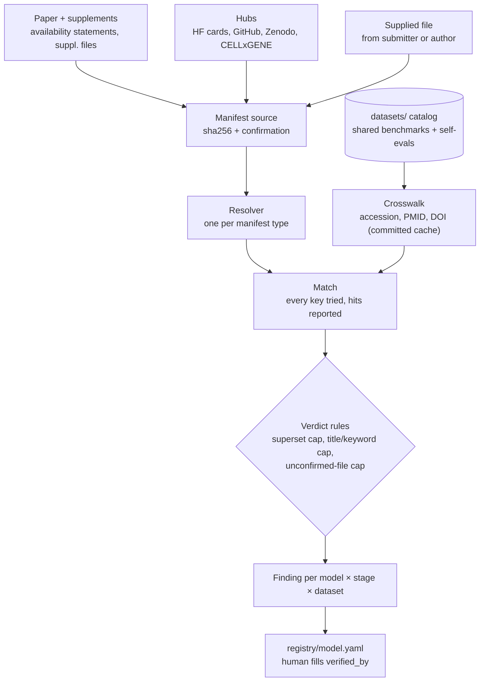
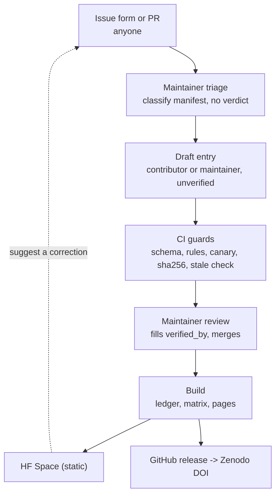
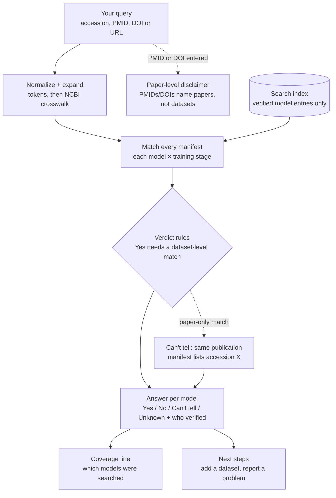

# How data flows through corpus-checker

*Two views of the same system: how a verdict is produced, and how a change reaches the public site. The rules themselves are in [RULES.md](RULES.md).*

---

## 1 — From a paper to a verdict

**Training-corpus side (left).** Wherever a model's training-data list lives — a supplementary table, a Hugging Face dataset card, a file someone hands us — it becomes a **manifest source** with two facts attached: its `sha256` (*what* we looked at) and its `confirmation` (*how we know it is the paper's file*):

| confirmation | means | allows definite verdicts? |
|---|---|---|
| `url_hash` | downloaded from the publisher or repo URL; the hash is of those bytes | yes |
| `api_snapshot` | a reproducible export of a versioned public corpus's own dataset table, committed to the repo | yes |
| `totals` | the file's contents add up to counts printed in the paper | yes |
| `author` | the authors confirmed it in writing | yes |
| `none` | supplied, not yet confirmed | **no — capped at `INCONCLUSIVE`** |

A **resolver** — one per manifest type — turns the file's rows into normalised records.

**Evaluation side (right).** Benchmarks live once, in `datasets/`, with every identifier they are known by. The **crosswalk** ties accession ↔ PMID ↔ DOI through NCBI, and its cache is committed so a check runs offline.

**Match** tries *every* key the manifest supports and reports which ones hit. **Verdict rules** then decide what can be claimed:

| verdict | means |
|---|---|
| `PRESENT` | exact match on accession, PMID or DOI — with the matched samples / cells |
| `NOT PRESENT` | exact match attempted on every required key, against every manifest file, and empty |
| `INCONCLUSIVE` | the match is weak — title or keyword only, a superset corpus, or an unconfirmed file — and says why |
| `NOT CHECKABLE` | the paper did not publish enough to answer. **A finding, not an error** |

There is **no model-level score**. Every verdict is for one model, one training stage, one dataset.

---

## 2 — From a submission to the site

**GitHub is the source of truth.** The site is rebuilt from `registry/` and `datasets/` on every merge and pushed to a static Hugging Face Space; nothing on the site is hand-written.

**Nothing automated claims a verdict.** Triage records what was found. Drafts arrive with `verified_by` empty, and CI blocks the merge until a person listed in `verifiers.yaml` signs. **If anyone later edits a verdict, CI blocks again until it is re-signed** — so a signature always means someone looked at the current claim.

**Corrections go in through the same door.** Every page links back to a GitHub issue. An entry names its sources, quotes, hashes and matched sample IDs, so a correction is a diff against a specific line. An author who disputes the framing rather than a fact gets a `disputed` block recorded in the entry — contested entries stay visible. See [RULES.md](RULES.md#corrections).

---

## 3 — Looking up a dataset

**Start from a dataset, not a model.** When you plan an evaluation, what matters is whether any model you compare against saw your evaluation data in training, not only your own model. The lookup takes any identifier and asks every verified model entry.

**Expansion.** A GEO series is expanded through NCBI to its paper's PMID and DOI and to its SRA/BioProject IDs, so manifests keyed any of those ways can be searched. A single sample (GSM) is never widened to its whole series.

**PMIDs and DOIs identify papers, not datasets.** A match on the paper alone is shown as *Can't tell — same publication*, with the accession the manifest lists, because one paper can publish several datasets. A query that is only a PMID or DOI is answered at the paper level, then separately for each dataset the paper links to.

**The index is static.** `lookup-index.json` holds every verified entry's identifiers, taken from the committed extracts and snapshots, so the lookup runs in the browser with no server. Every answer says which entry it came from and who verified it, and every result lists which models were searched.

## 4 — Two views from one set of files

The **ledger** is derived by inverting every registry entry on dataset. It is never written by hand, so it cannot disagree with the entries.

- **Model page** — the model's own evaluation datasets first (`self-eval`), then every other benchmark in the catalog (`catalog`).
- **Dataset page** — for one benchmark, which models trained on it (and at which stage) and which evaluated on it. **This is the reuse map**: the same dataset can be training data for one model and evaluation data for another. *Norman 2019 is in scFoundation's pretraining corpus and is an evaluation dataset for scFoundation, scGPT and GEARS users.*

> **Exposure, not effect.** Overlap does not by itself mean a reported number is inflated — Geneformer's own in/out experiment found essentially equivalent results for cells inside and outside its pretraining corpus.
